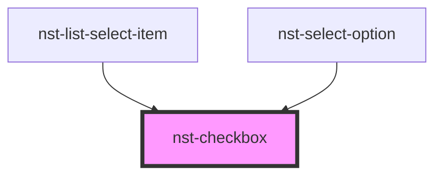

# nst-checkbox

<!-- Auto Generated Below -->

## Properties

| Property        | Attribute       | Description           | Type      | Default     |
| --------------- | --------------- | --------------------- | --------- | ----------- |
| `checked`       | `checked`       | Is it checked         | `boolean` | `undefined` |
| `disabled`      | `disabled`      | Is it disabled        | `boolean` | `undefined` |
| `indeterminate` | `indeterminate` | Is it indeterminate   | `boolean` | `undefined` |
| `label`         | `label`         | Checkbox label (text) | `string`  | `undefined` |
| `name`          | `name`          | Checkbox label (text) | `string`  | `undefined` |

## Events

| Event           | Description            | Type                   |
| --------------- | ---------------------- | ---------------------- |
| `checkedChange` | Emit on checked change | `CustomEvent<boolean>` |

## Dependencies

### Used by

 - [nst-list-select-item](../list-select/item)
 - [nst-select-option](../select/select-option)

### Graph

----------------------------------------------

*Built with [StencilJS](https://stenciljs.com/)*
