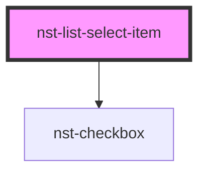

# nst-list-select-item

<!-- Auto Generated Below -->

## Properties

| Property       | Attribute      | Description            | Type                           | Default     |
| -------------- | -------------- | ---------------------- | ------------------------------ | ----------- |
| `description`  | `description`  | Description of item    | `string`                       | `undefined` |
| `disabled`     | `disabled`     | Disabled option        | `boolean`                      | `undefined` |
| `has_checkbox` | `has_checkbox` | If Item has checkbox   | `boolean`                      | `false`     |
| `is_selected`  | `is_selected`  | Is it active           | `boolean`                      | `false`     |
| `item_title`   | `item_title`   | Main title of item     | `string`                       | `undefined` |
| `name`         | `name`         | Form element name      | `string`                       | `undefined` |
| `value`        | `value`        | List select item value | `number \| string \| string[]` | `undefined` |

## Events

| Event                       | Description     | Type               |
| --------------------------- | --------------- | ------------------ |
| `listSelectItemValueChange` | Emits on select | `CustomEvent<any>` |

## Dependencies

### Depends on

- [nst-checkbox](../../checkbox)

### Graph

----------------------------------------------

*Built with [StencilJS](https://stenciljs.com/)*
