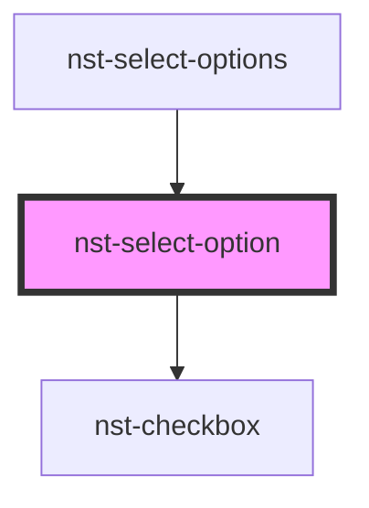

# nst-select-option

<!-- Auto Generated Below -->

## Properties

| Property        | Attribute       | Description                                                           | Type         | Default     |
| --------------- | --------------- | --------------------------------------------------------------------- | ------------ | ----------- |
| `bordered`      | `bordered`      | Contains a border? Used for special options (e.g. select None)        | `boolean`    | `undefined` |
| `checked`       | `checked`       | Is it checked                                                         | `boolean`    | `undefined` |
| `disabled`      | `disabled`      | Disabled option                                                       | `boolean`    | `undefined` |
| `indeterminate` | `indeterminate` | Is indeterminate allowed for multiple checked                         | `boolean`    | `undefined` |
| `multiple`      | `multiple`      | Is multiple selection allowed                                         | `boolean`    | `undefined` |
| `not_breakable` | `not_breakable` | Not breakable items, will take more space if needed than input itself | `boolean`    | `undefined` |
| `option`        | --              | Option configuration - all needed data to render one option           | `OptionItem` | `undefined` |

## Events

| Event          | Description                 | Type                  |
| -------------- | --------------------------- | --------------------- |
| `selectOption` | Emits on select this option | `CustomEvent<string>` |

## Dependencies

### Used by

 - [nst-select-options](../select-options)

### Depends on

- [nst-checkbox](../../checkbox)

### Graph

----------------------------------------------

*Built with [StencilJS](https://stenciljs.com/)*
