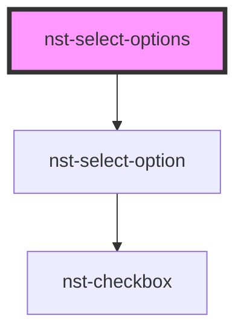

# nst-select-options

<!-- Auto Generated Below -->

## Properties

| Property                  | Attribute                 | Description                                                           | Type                             | Default     |
| ------------------------- | ------------------------- | --------------------------------------------------------------------- | -------------------------------- | ----------- |
| `inline_input`            | `inline_input`            | Inline input variation                                                | `boolean`                        | `undefined` |
| `label`                   | `label`                   | Input label                                                           | `string`                         | `undefined` |
| `multiple`                | `multiple`                | Enable multiple selection                                             | `boolean`                        | `undefined` |
| `multiple_selected_label` | `multiple_selected_label` | Label if more then 1 option is selected                               | `string`                         | `undefined` |
| `not_breakable`           | `not_breakable`           | Not breakable items, will take more space if needed than input itself | `boolean`                        | `undefined` |
| `options`                 | --                        | Options configurations                                                | `OptionItem[]`                   | `[]`        |
| `placeholder`             | `placeholder`             | Input placeholder                                                     | `string`                         | `undefined` |
| `required`                | `required`                | Is it required                                                        | `boolean`                        | `undefined` |
| `search_label`            | `search_label`            | Label for search bar                                                  | `string`                         | `undefined` |
| `searchable`              | `searchable`              | Enable search will add search bar                                     | `boolean`                        | `undefined` |
| `select_all`              | `select_all`              | Select all (check all) possibility                                    | `boolean`                        | `undefined` |
| `select_all_label`        | `select_all_label`        | Label for select all option                                           | `string`                         | `undefined` |
| `select_none`             | `select_none`             | Select none (clear) possibility                                       | `boolean`                        | `undefined` |
| `select_none_label`       | `select_none_label`       | Label for select none option                                          | `string`                         | `undefined` |
| `size`                    | `size`                    | Input size                                                            | `"large" \| "medium" \| "small"` | `'medium'`  |
| `value`                   | `value`                   | Select element value                                                  | `number \| string \| string[]`   | `undefined` |

## Events

| Event                  | Description                   | Type                   |
| ---------------------- | ----------------------------- | ---------------------- |
| `dropdownOpenChange`   | Emits on dropdown open change | `CustomEvent<boolean>` |
| `dropdownSearchChange` | Emits on search value change  | `CustomEvent<string>`  |
| `dropdownValueChange`  | Emits on value change         | `CustomEvent<any>`     |

## Methods

### `select(newOption: string) => Promise<string | number | string[]>`

#### Returns

Type: `Promise<string | number | string[]>`

## Dependencies

### Depends on

- [nst-select-option](../select-option)

### Graph

----------------------------------------------

*Built with [StencilJS](https://stenciljs.com/)*
